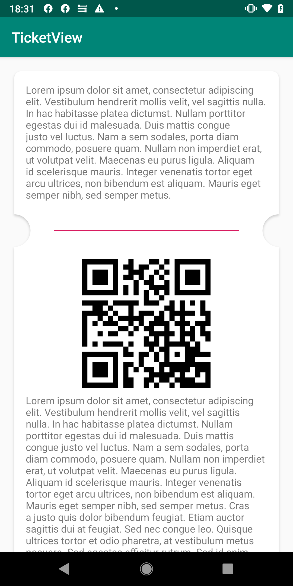
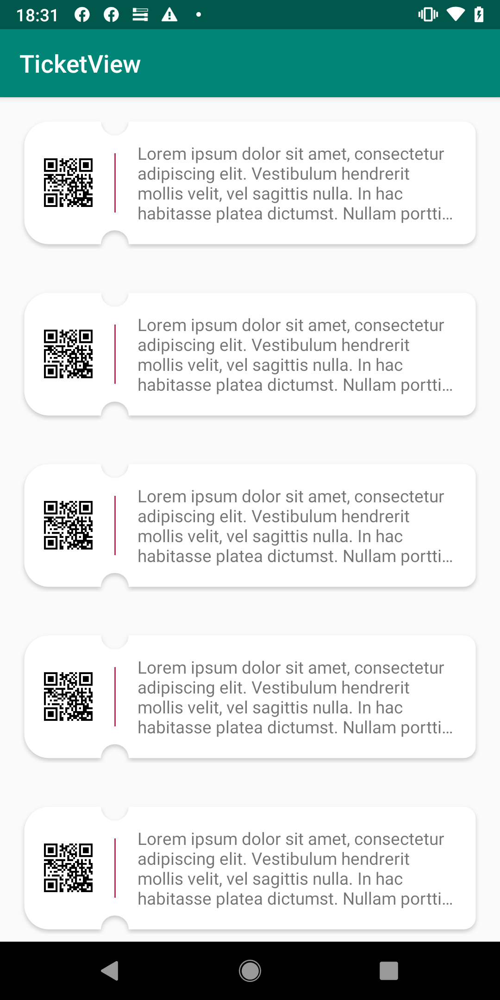

# TicketView
TicketView with scallops, corners and shadow management.

[](https://android-arsenal.com/api?level=14)
[](https://opensource.org/licenses/MIT)


TicketView - Vertical      |  TicketView - Horizontal
:-------------------------:|:-------------------------:
  |  


## How to use:question:
  ```
  <io.carlol.android.ticketview.TicketView
      android:id="@+id/ticketView"
      android:layout_width="match_parent"
      android:layout_height="wrap_content"
      android:layout_margin="16dp"
      android:background="@android:color/transparent"
      android:padding="20dp"
      app:tv_anchor="@+id/line"
      app:tv_backgroundColor="@android:color/white"
      app:tv_cornerRadius="10dp"
      app:tv_elevation="10dp"
      app:tv_holeRadius="60"
      app:tv_orientation="vertical">

      <!-- todo: adding your views -->

      </LinearLayout>

  </io.carlol.android.ticketview.TicketView>
```

## Installation

```gradle
implementation 'io.carlol.android:ticketview:1.0.1'
```

## Attributes

| Name | Description |
| ------ | ------ |
| tv_anchor | determines where separator is drawn |
| tv_holeRadius (optional) | scallop radius (default: 15f) |
| tv_orientation (optional)| ticket orientation (default: VERTICAL) |
| tv_backgroundColor (optional) | view background color (default: Color.WHITE) |
| tv_showBorder (optional) | show border (default: false) |
| tv_borderColor (optional) | view border color (default: Color.GRAY) |
| tv_borderWidth (optional) | view border width (default: 0dp) |
| tv_elevation (optional) | view elevation (default: 0dp) |
| tv_cornerRadius (optional) | corner radius (default: 0dp) |
| tv_topLeftCornerRadius (optional) | specific corner radius (default: tv_cornerRadius value) |
| tv_topRightCornerRadius (optional) | specific corner radius (default: tv_cornerRadius value) |
| tv_bottomRightCornerRadius (optional) | specific corner radius (default: tv_cornerRadius value) |
| tv_bottomLeftCornerRadius (optional) | specific corner radius (default: tv_cornerRadius value) |


## License
```
   Copyright 2019 Carlo Luchessa
   
   Permission is hereby granted, free of charge, to any person obtaining 
   a copy of this software and associated documentation files, to deal 
   in the Software without restriction, including without limitation 
   the rights to use, copy, modify, merge, publish, distribute, sublicense, 
   and/or sell copies of the Software, and to permit persons to whom the Software 
   is furnished to do so, subject to the following conditions:
   
   The above copyright notice and this permission notice shall be 
   included in all copies or substantial portions of the Software.
   
   THE SOFTWARE IS PROVIDED "AS IS", WITHOUT WARRANTY OF ANY KIND, 
   EXPRESS OR IMPLIED, INCLUDING BUT NOT LIMITED TO THE WARRANTIES 
   OF MERCHANTABILITY, FITNESS FOR A PARTICULAR PURPOSE AND NONINFRINGEMENT. 
   IN NO EVENT SHALL THE AUTHORS OR COPYRIGHT HOLDERS BE LIABLE FOR ANY CLAIM, 
   DAMAGES OR OTHER LIABILITY, WHETHER IN AN ACTION OF CONTRACT, 
   TORT OR OTHERWISE, ARISING FROM, OUT OF OR IN CONNECTION WITH THE SOFTWARE 
   OR THE USE OR OTHER DEALINGS IN THE SOFTWARE.
   
